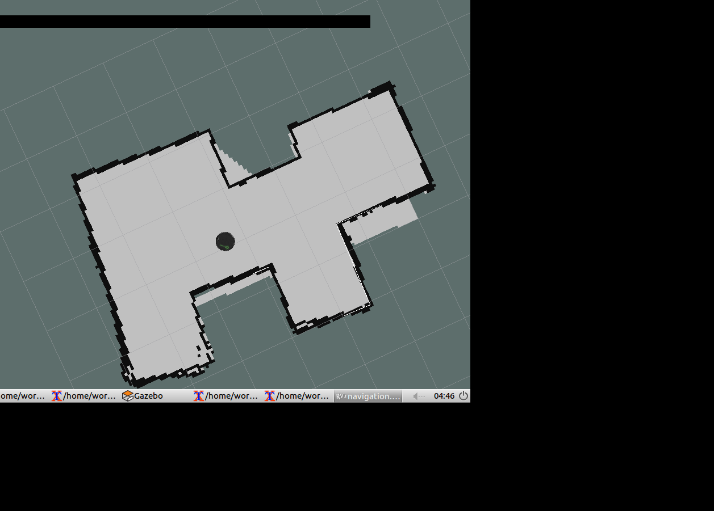
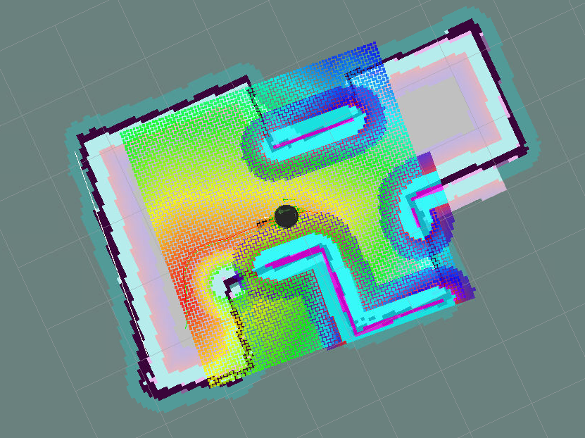
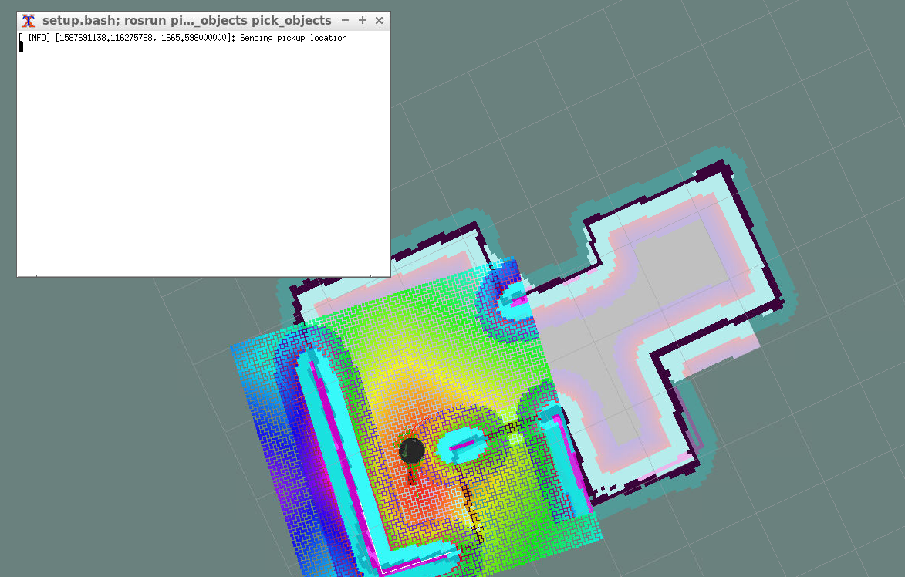
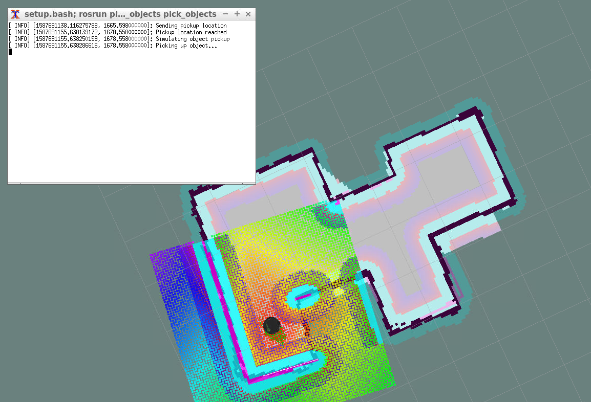
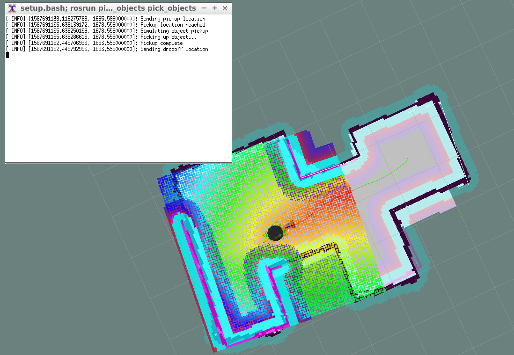
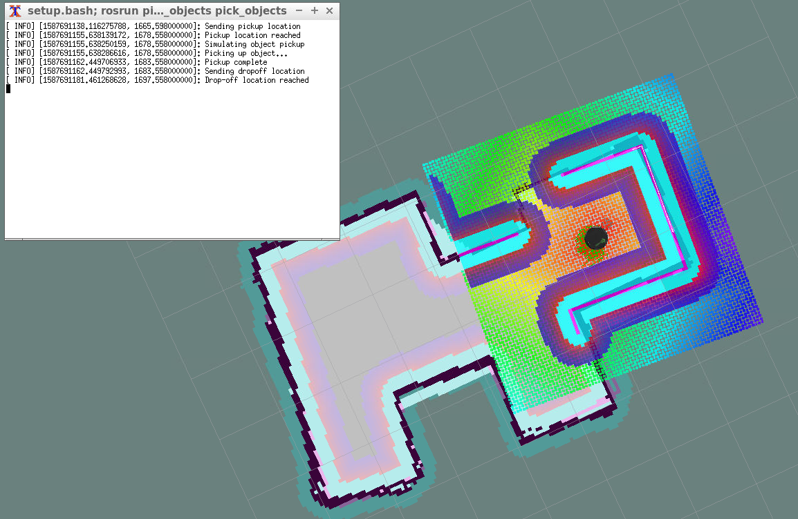
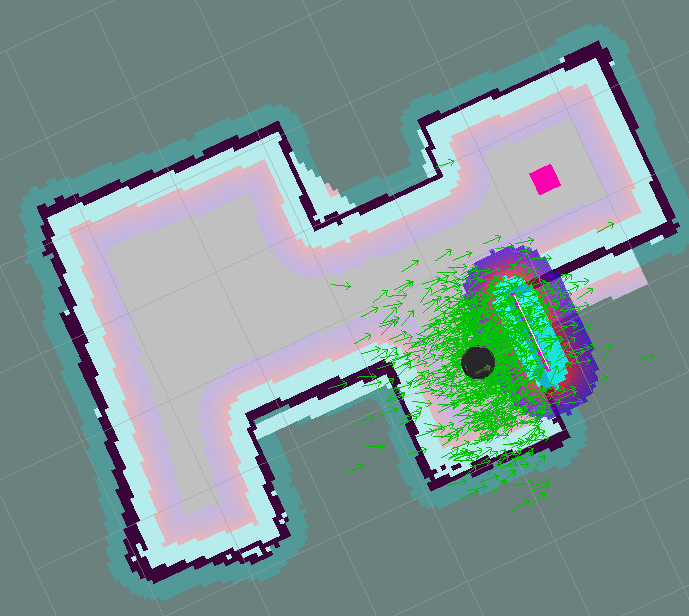
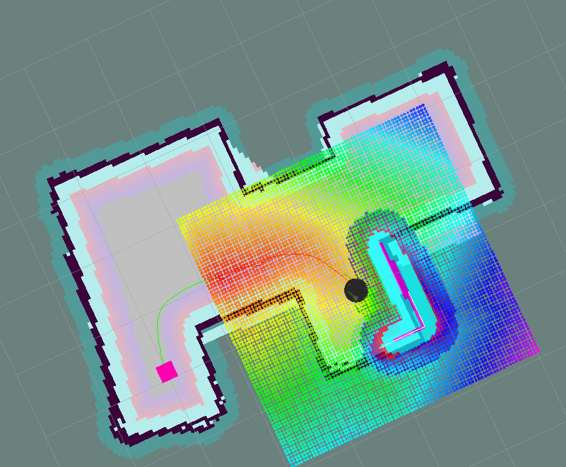
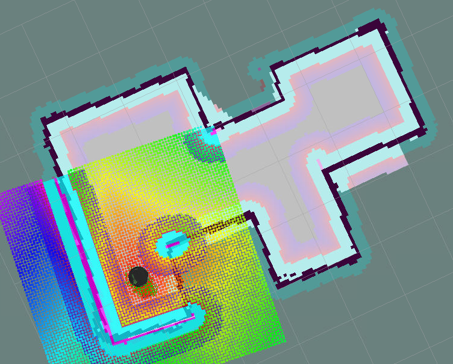
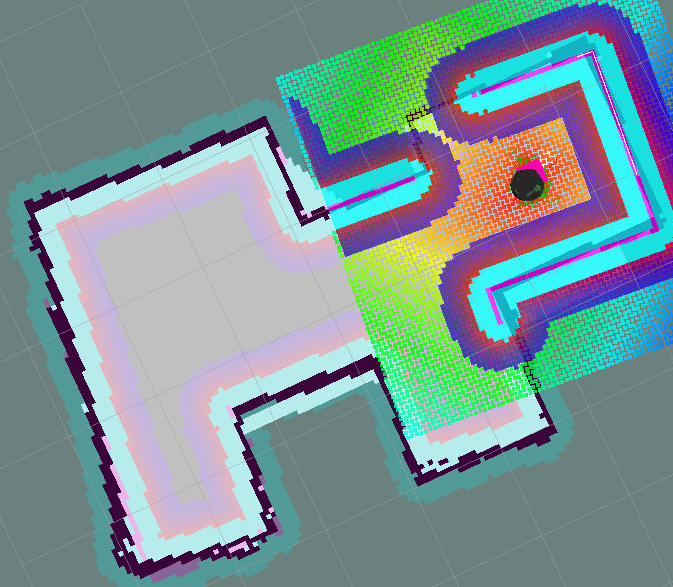

# Udacity Robotics Engineer Nanodegree
## Project 5: Home Service Robot

### Setup
To get the project setup we will first clone the repo and run the setup script which will update
the environment and install necessary pacakges and make the project.
``` shell
git clone https://github.com/racersmith/RoboND_Project5.git
cd RoboND_Project5
chmod +x setup.sh
./setup.sh
```

## Project Sections
### Simulation Setup
Launching the basic world can be accomplished with:
``` shell
./catkin_ws/src/scripts/launch.sh
```
This will launch the simulation environment, ros and rviz.

### Mapping
The AMCL SLAM can be run with the script
``` shell
./catkin_ws/src/scripts/test_navigation
```
This will launch the simulation envrionment, rviz and give you keyboard teleop control of the robot platform.  The SLAM system will genererate a map as the robot is navigated around the environment.  Below is a map generated after navigating around the environment.

This map can then be saved using:
``` shell
rosrun map_server map_saver -f /home/workspace/RoboND_Project5/catkin_ws/src/map/basic
```
This will save a `basic.yaml` and `basic.pgm` file to the `map/` directory.  This map file will be used for localization and navigation.

### Localization and Navigation
#### Navigation Demo
You can launch the localization and navigation demo with the script:
``` shell
./catkin_ws/src/scripts/test_navigation.sh
```
This will launch the simulation environment, AMCL localization, and rviz.  You can then use the goal pose tool in rviz to give navigation commands.


#### Pick Demo
To automate the goal locations to simulate a object pick and place you can launch the demo with the script:
``` shell
./catkin_ws/src/scripts/pick_objects.sh
```
This will launch the simulation environment, localization, navigation and an automated goal pose publisher that will give a pickup location goal.  Once the robot reaches the goal it simulates the time to pick and object, 5-seconds, then sends a new drop-off location goal.  Here is an example of the pick object demo:






### Home Service
#### Marker Demo
To simulate an object being picked up and dropped off we use marker objects in rviz.  This demonstration can be done with the script:
``` shell
./catkin_ws/src/scripts/add_marker.sh
```
This will launch the simulation environment, rvis and the `add_marker` node.  This `add_marker` will display and object at the pickup location for 5-seconds. The object will disappear for 5-seconds then it will reappear in the drop off location.




### Home Service Demo
To demonstrate the complete home service protocol the robot will navigate to a visualized object shown in rviz.  Once the robot reaches the pickup object, the object will disappear.  After the robot finishes the pickup, 5-seconds, the robot will navigate to the drop-off location.  Once the robot reaches the drop-off location the object will reappear.
This demonstration can be shown with the script:
``` shell
./catkin_ws/src/scripts/home_service.sh
```




  
